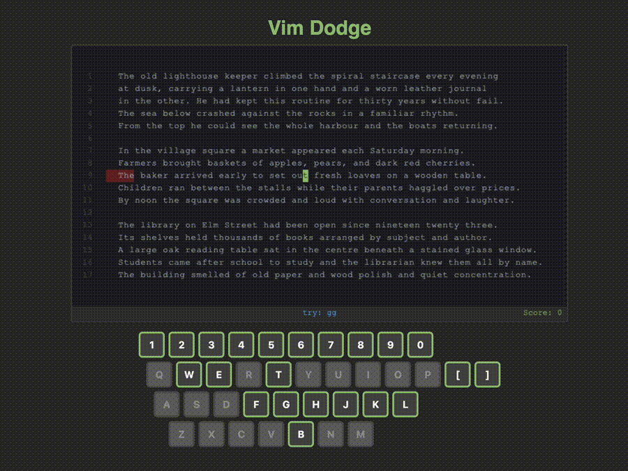

# Vim Dodge

A browser game that teaches vim navigation by dodging walls. Primarily written with Claude Code.



Walls sweep across a text display and you navigate using vim keybindings to avoid them. The game introduces new keys progressively as difficulty increases, with hints showing which command to use.

## Supported keys

- `h` `j` `k` `l` — basic movement
- `w` `e` `b` — word navigation
- `0` `$` — line start/end
- `gg` `G` `5gg` — jump to line
- `{` `}` — paragraph jumps
- `f` `t` `F` `T` — find character
- `mx` `'x` `` `x `` `''` — marks

## Usage

```
make run
```
